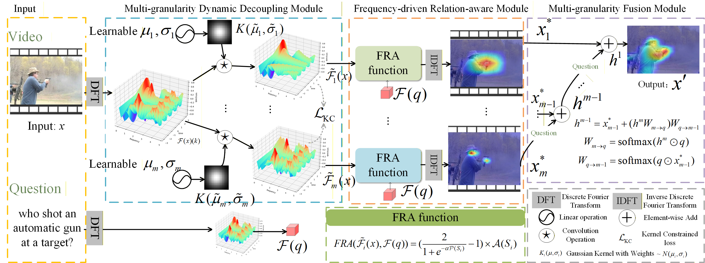

# FMDA: Frequency-Constrained Multi-Granularity Dynamic Alignment Attention for VideoQA

Release the code for FMDA

MFDA Unit             
-------------------------
  

## evaluate on VideoQA
download our pre-extracted features and Pretrained model for VideoQA from https://pan.baidu.com/s/1DieJkCFaW1jzp5EuFes5Jw?pwd=mdi5 提取码: mdi5 and save them in `data` folder.
   

## Acknowledgement
- As for motion feature extraction, we adapt ResNeXt-101 model from this [repo](https://github.com/kenshohara/video-classification-3d-cnn-pytorch) to our code. Thank @kenshohara for releasing the code and the pretrained models. 
- We refer to this [repo](https://github.com/facebookresearch/clevr-iep) for preprocessing.
- Our implementation of dataloader is based on this [repo](https://github.com/shijx12/XNM-Net).
- We adapt HCRN-videoQA from this [repo](https://github.com/thaolmk54/hcrn-videoqa) to our code. Thank @thaolmk54 for releasing the code and the pretrained models. 